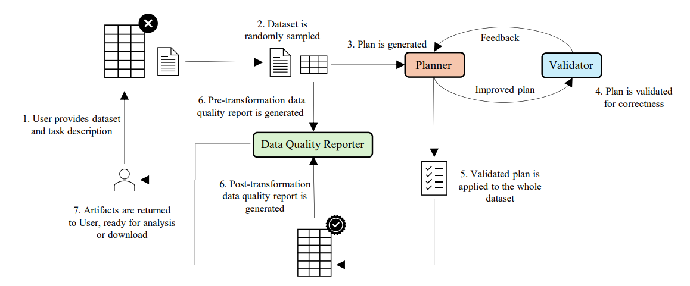
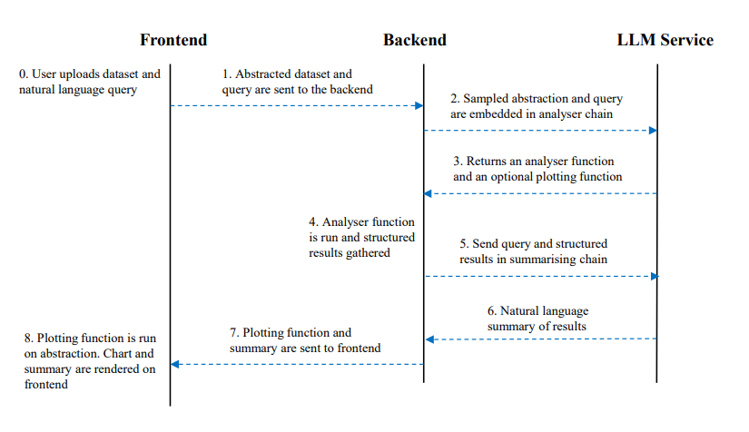
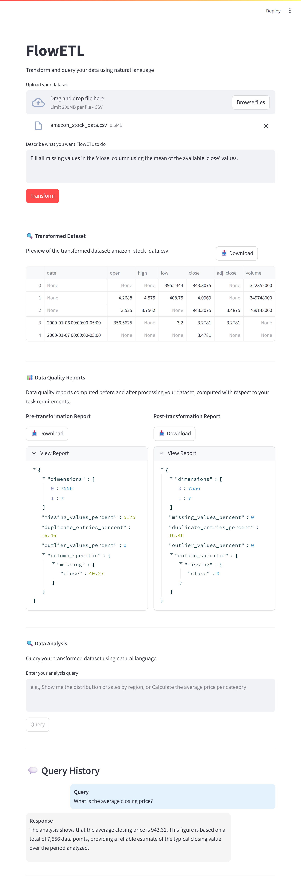

# FlowETL - Data Engineering with Natural Language

FlowETL serves as a natural language interface for data engineering (preparation) and data science. It lets users prepare any uploaded `.csv` dataset by simply describing their data preparation requirements, as opposed to configure a series of steps using a graphical user interface or writing a script, which is the case for most data preparation tools on the market.

### Architecture

The main components of FlowETL are the planning and validation agents. The planning agent is responsible for generating or updating its previously generated plan based on the feedback received by the validation agent, if any.

The plan generated consists of a JSON object with several metadata fields and a `pipeline` field consisting of a list of Nodes configurations, which once applied sequentially to the input dataframe should achieve the data preparation task requested by the user. The Planner is supplied with a short prompt that contains the FlowETL documentation, the dataset sample, the task description, and optional feedback from the validator.

The validation agent ingests the most recent generated plan and the user's task description and produces structured feedback in regards to the syntax of the plan and the logical correctness of the plan based on the FlowETL documentation. The feedback is then passed back to the Planner. This cycle continues for at most `MAX_RETRIES`(plan cannot be generated) or when the feedback is empty (plan is validated).



**Design Considerations**

- Why validate? Using LLMs enables FlowETL to process complex data preparation requirements, however this also introduces risks associated with hallucinations and inconsistencies. Introducing the validation agent has significantly reduced the chances of plan failure at a small increase in resources (tokens, API credits) used.

- Why sample? FlowETL uses a random sample of the input dataset to generate and validate a plan, then it applies it on the entire dataset. Sampling reduces token usage, latency, and the risks of hallucinations for larger datasets. Opting for generating a plan and applying it programmatically makes it easier to spot mistakes and hallucinations since the parsing logic would fail to apply the plan altogether. The major assumption here is that the plan computed for the sample will generalise to the entire dataset, which might lead to unexpected failures. During testing and validation, this issue has not been encountered.

**Data Quality Reporter**

This component generates reports before and after dataset processing, allowing users to measure improvements against their specific task requirements. Instead of producing a generic report, it tailors the analysis to what the user needs. Once the plan is validated, both reports are created by parsing the plan and using node configurations to identify potential anomalies such as missing values, outliers, or duplicates that could affect data quality.

After the artifacts are returned to the frontend, the user can run some initial data analysis queries on the transformed dataset, again using only natural language. FlowETL caches the transformed dataset so the user can run multiple queries sequentially. The steps involved in the data analysis workflow are shown below:



### FlowETL Nodes and Data Types

FlowETL defines an internal set of nodes available to the LLM during the plan generation phase. A node is simply a function which takes in an intermediary version of the dataset to be transformed and some configuration parameters, modifies the dataset in some way, and returns it. Nodes are composable into pipelines, but non-commutative, meaning that applying the pipeline _[nodeA, nodeB]_ may lead to different results than _[nodeB, nodeA]_. This issue is accounted for during the plan generation-validation cycle. The available nodes are:

<details>
<summary><strong>MissingValues</strong></summary>

Detects and handles missing values with column-specific strategies.

**Parameters:**

- `columns`: Dictionary mapping column names to their missing value handling configuration. Example configuration structure:

```
{
  column_name: {
    detect (optional): [list of values considered missing for this column],
    strategy (required): handling strategy,
    user_value (required, depending on strategy): value for user-defined imputation
  },
  ...
}
```

**Strategies:**

- `drop_row`: Remove rows containing missing values
- `drop_column`: Remove column if the majority of values are missing
- `impute_user`: Replace with user-provided value
- `impute_auto`: Automatically impute based on inferred column type
- `mean`: Fill with column mean (numeric columns only)
- `median`: Fill with column median (numeric columns only)
- `mode`: Fill with column mode
- `forward_fill`: Forward fill missing values
- `backward_fill`: Backward fill missing values

</details>

<details>
<summary><strong>Duplicates</strong></summary>

Removes duplicate records from the dataset.

**Behavior:**

- Detection: Row-by-row comparison
- Handling: Automatic removal of duplicates
- No additional parameters required

</details>

<details>
<summary><strong>OutliersAndAnomalies</strong></summary>

Detects and handles outliers and anomalies with column-specific strategies.

**Parameters:**

- `columns`: Dictionary mapping column names to their outlier handling configuration. Example configuration structure:

```
{
  column_name: {
    normal_values (required): definition of normal values (see below),
    strategy (required): handling strategy,
    user_value (optional, depending on strategy): user-defined value for imputation
  },
  ...
}
```

**Normal Values Definition:**

- **List**: Explicit list of acceptable values
- **Range**: Min/max bounds for acceptable values
- **Condition**: Boolean expression defining normal values
- **Auto** : Automatically detect outliers in numerical columns

**Strategies:**

- `drop`: Remove rows containing outliers
- `impute_user`: Replace with user-provided value
- `impute_auto`: Automatic imputation based on FlowETL column type
- `mean`: Replace with column mean (numeric only)
- `median`: Replace with column median (numeric only)
- `mode`: Replace with column mode

</details>

<details>
<summary><strong>DropRow</strong></summary>

Drops rows that meet the specified condition.

**Parameters:**

- `condition`: Pandas lambda function code snippet that evaluates to boolean result. True if the input row meets the condition, False otherwise.

</details>

<details>
<summary><strong>DeriveColumn</strong></summary>

A versatile node for all column operations including creation, transformation, merging, splitting, renaming, and dropping.

**Parameters:**

- `source`: Single source column name (for split/transform/rename/drop operations) or list of source columns (for merge operations)
- `target`: Single target column name (for create/transform/rename operations) or list of target columns (for split operations)
- `function`: Pandas-compatible transformation lambda code/expression
- `drop_source`: Boolean - whether to drop source column(s) after operation

**Operation Types:**

1. **Merge Columns** - Combine multiple source columns into one new target column.

- Set: `source` (list), `target`, `function` (merging logic)
- Optional: `drop_source=true` to remove source columns

2. **Split Column** - Split one source column into multiple target columns.

- Set: `source`, `target` (list), `function` (splitting logic)
- Optional: `drop_source=true` to remove source column

3. **Create Column** - Create new column from existing column(s), keeping the source.

- Set: `source`, `target`, `function`
- Set: `drop_source=false` to keep source columns

4. **Standardize/Transform Column** - Apply transformation to column in-place.

- Set: `source`, `target` (same as source), `function`
- Set: `drop_source=true` to replace original column

5. **Rename Column** - Change column name without transformation.

- Set: `source`, `target`
- No `function` needed
- Set: `drop_source=false`

6. **Drop Column** - Remove column from dataset.

- Set: `source`, `drop_source=true`
- No `target` or `function` needed

**Function Examples:**

- Concatenation: `lambda row: row['col1'] + ' ' + row['col2']`
- Mathematical: `lambda x: x * 100`
- Conditional: `lambda x: 'High' if x > 100 else 'Low'`
- Date extraction: `lambda x: pd.to_datetime(x).year`
- Splitting: `lambda x: x.split(',')`

</details>

**Data Types**

FlowETL defines its own internal data types for easier processing and edge-case handling. With each plan generated by the planning agent, a schema for the sampled dataset is inferred based on the types described below. Data types for the schema inference task:

- `Number` : Numerical values
- `String` : Text or string values
- `Date` : Temporal values
- `Boolean` : Boolean values
- `Complex` : List, Dictionaries

### Running the Project

Within the root project folder:

1. Create a virtual environment and install the required libraries with `pip install -r requirements.txt`
2. Running the project requires the user to supply their own [OpenAI API key](https://platform.openai.com/api-keys). Once obtained, it should be placed in a `.env` file as `OPENAI_API_KEY="<your-key>"`.
3. To run the API backend, run the command `uvicorn backend.main:app --reload --host 0.0.0.0 --port 8000`
4. To run the Streamlit frontend, opena another terminal and run the command `streamlit run frontend/dashboard.py`. A browser window similar to the one show below should open automatically.

Now that the project is running, simply upload a CSV file and type your data preparation requirements. If successful, the transformed dataset, data quality reports, and data analysis chatbot should render sequentially. You can download all artifacts generated. **NOTE** that the frontend will cache all artifacts until you refresh the browser or start a new Transform request.

**Project Files and Folders explained**

- /logs : Log files are generated for each request received by the API. For each request, key metrics and checkpoints are written to both its log file and to terminal. The naming convention for each file is `T{request timestamp}\_ID{request ID}`.
- /test : This folder contains some datasets for you to experiment with, as well as a series of tasks for each dataset found in `tasks.json`. Each dataset comes with an easy, medium, difficult, unrelated, and erroneous task, all used during testing. These can be re-generated by running the script `testcases_generator.py`. Another important script is `test_manager.py`, which tests FlowETL using each task for each dataset and storing the results for analysis.



### Future work

- **Log Analysis** - For each request, a log file is produced with the request ID. The idea is to store log files over time and analyse them in hope of extracting metrics, trends, and identify any bottlenecks over time. As a first step, the file handler for the logger should be configured to produce machine-readable logs in json format to allow for easier information extraction. Results could also be visualised in Grafana/Kibana dashboards.

- **Privatise Data Processing** - Privatise the application by using an LLM provisioned through Ollama instead of the OpenAI API. This removes the need to buy tokens and allows for completely local data processing. Research into

- **Support for JSON files** - Implement an abstraction and reverse-abstraction mechanism to convert JSON files to a structured dataset, allowing FlowETL to process them. The conversion method described in the original FlowETL [paper](https://www.arxiv.org/abs/2507.23118) could be a good starting point.

- **Expand the Nodes set** - The current nodes set was designed to account for most data preparation requirements, therefore some tasks may not currently be possible within FlowETL. Feel free to define more nodes according to your specific needs and include them in the ecosystem.
